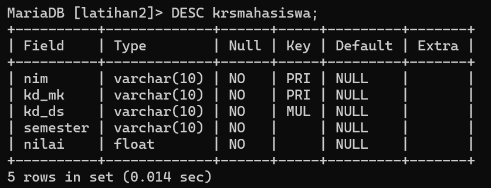
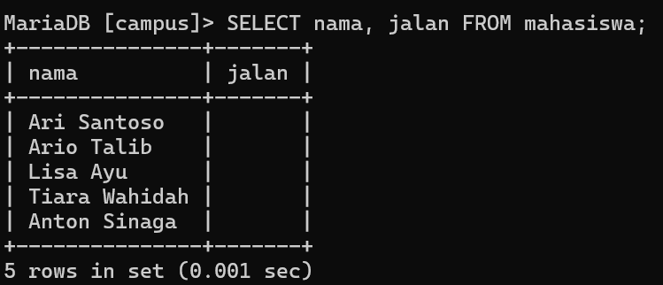
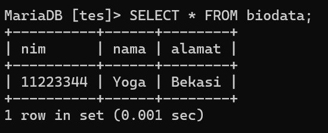

## DATA MODELING MAP (DML)
```
mahasiswa (nim, nama, jenis_kelamin, tgl_lahir, jalan, kota, kodepos, no_hp, kd_ds)
dosen (kd_ds, nama)
matakuliah (kd_mk, nama, sks)
jadwalmengajar (kd_ds, kd_mk, hari, jam, ruang)
krsmahasiswa (nim, kd_mk, kd_ds, semester, nilai)
```
- Buat DDL Script berdasarkan skema ERD tersebut diatas. 
- Jalankan script DDL tersebut pada DBMS MySQL.

## Langkah-langkah :

## 1. Membuat tabel mahasiswa :
```
CREATE TABLE mahasiswa (
    nim VARCHAR(10) PRIMARY KEY,
    nama VARCHAR(25) NOT NULL,
    jenis_kelamin ENUM('Laki-Laki', 'Perempuan'),
    tgl_lahir DATE NOT NULL,
    jalan VARCHAR(15) NOT NULL,
    kota VARCHAR(15) NOT NULL,
    kodepos VARCHAR(5) NOT NULL,
    no_hp VARCHAR(15) NOT NULL,
    kd_ds VARCHAR(10) NOT NULL,
    FOREIGN KEY (kd_ds) REFERENCES Dosen(kd_ds)
    );
```

## Tampilkan hasil Tabel :
```DESC mahasiswa;```


## 2. Membuat tabel dosen :
```
CREATE TABLE dosen (
    kd_ds VARCHAR(10) PRIMARY KEY,
    nama VARCHAR(35) NOT NULL
    );
```
## Tampilkan tabel :
```DESC dosen;```


## 3. Membuat tabel mata kuliah;
```
CREATE TABLE matakuliah (
    kd_mk VARCHARr(10) PRIMARY KEY,
    nama VARCHARr30) NOT NULL,
    sks INT NOT NULL
    );
```

## Tampilkan tabel :
```DESC matakuliah;```


## 4. Membuat tabel jadwal mengajar :
```
CREATE jadwalmengajar (
    kd_ds VARCHAR(10) NOT NULL,
    kd_mk VARCHAR(10) NOT NULL,
    hari ENUM('Senin', 'Selasa', 'Rabu', 'Kamis', 'Jumat', 'Sabtu', 'Minggu') NOT NULL,
    jam TIME NOT NULL,
    ruang VARCHAR(555) NOT NULL,
    PRIMARY KEY (kd_ds, kd_mk, hari, jam),
    FOREIGN KEY (kd_ds) REFERENCES Dosen(kd_ds),
    FOREIGN KEY (kd_mk) REFERENCES Matakuliah(kd_mk)
    ); 
```

# Tampilkan tabel :
```DESC jadwalmengajar;```


## 5. Membuat tabel KRS mahasiswa :
```
CREATE TABLE KRSMahasiswa (
    nim VARCHAR(10) NOT NULL,
    kd_mk VARCHAR(10) NOT NULL,
    kd_ds VARCHAR(10) NOT NULL,
    semester VARCHAR(10) NOT NULL,
    nilai FLOAT NOT NULL,
    PRIMARY KEY (nim, kd_mk),
    FOREIGN KEY (nim) REFERENCES Mahasiswa(nim),
    FOREIGN KEY (kd_mk) REFERENCES Matakuliah(kd_mk),
    FOREIGN KEY (kd_ds) REFERENCES Dosen(kd_ds)
    );
```
## Tampilkan tabel :
`DESC krsmahasiswa;`



# Soal Latihan Praktikum

Berdasarkan table Mahasiswa pada praktikum sebelumnya: (nim, nama, jenis_kelamin, tgl_lahir, jalan, kota, kodepos, no_hp, kd_ds)

# Isi data pada table tersebut sebanyak minimal 5 record data. Tampilkan semua isi/record tabel!

- Ubah data tanggal lahir Mahasiswa yang bernama Ari menjadi: 1979-08-31!
- Tampilkan satu baris / record data yang telah diubah tadi yaitu record dengan nama Ari saja!
- Hapus Mahasiswa yang bernama Dina!
- Tampilkan record atau data yang tanggal kelahirannya lebih dari atau sama dengan 1996-1-2!
- Tampilkan semua Mahasiswa yang berasal dari Bekasi dan berjenis kelamin perempuan!
- Tampilkan semua Mahasiswa yang berasal dari Bekasi dengan kelamin laki-laki atau Mahasiswa yang berumur lebih dari 22 tahun dengan kelamin wanita!
- Tampilkan data nama dan alamat Mahasiswa saja dari tabel tersebut
- Tampilkan data Mahasiswa terurut berdasarkan nama.

## Mengisi tabel dengan minimal 5 record data :
```
INSERT INTO mahasiswa (nim, nama, jenis_kelamin, tgl_lahir, jalan, kota, kodepos, no_hp, kd_ds) VALUES
(11223344,"ari santoso","Laki-laki","1998-10-12","","Bekasi","","",""), 
(11223345,"ario talib","Laki-laki","1999-11-16","","Cikarang","","",""), 
(11223346,"dina marlina","Perempuan","1997-12-01","","Karawang","","",""), 
(11223347,"lisa ayu","perempuan","1996-01-02","","Bekasi","","",""), 
(11223348,"tiara wahidah","perempuan","1980-02-05","","Bekasi","","",""), 
(11223349,"anton sinaga","laki-laki","1988-03-10","","Cikarang","","","");
```
## Menampilkan semua isi/record pada tabel bisa menggunakan kode berikut :

```SELECT * FROM mahasiswa;```


## - Mengubah data tanggal lahir Mahasiswa yang bernama Ari menjadi : 1979-08-31 menggunakan kode berikut :

```UPDATE mahasiswa SET tgl_lahir='1979-08-31' WHERE nama='Ari Santoso;```


## - Menampilkan satu baris / record data yang telah diubah tadi yaitu record dengan nama Ari saja dengan cara sebagai berikut :

```SELECT * FROM mahasiswa WHERE nama='Ari Santoso;```


## - Menghapus Mahasiswa yang bernama Dina dengan cara sebagai berikut:

```DELETE FROM mahasiswa WHERE nama='Dina Marlina';```


## - Menampilkan record atau data yang tanggal kelahirannya lebih dari atau sama dengan 1996-1-2 dengan cara sebagai berikut :

```SELECT * FROM mahasiswa WHERE tgl_lahir<='1996-01-02';```


## - Menampilkan semua Mahasiswa yang berasal dari Bekasi dan berjenis kelamin perempuan dengan cara sebagai berikut :

```
SELECT * FROM mahasiswa WHERE kota='bekasi' AND jenis_kelamin='Perempuan';
```


## -  Menampilkan semua Mahasiswa yang berasal dari Bekasi dengan kelamin laki-laki atau Mahasiswa yang berumur lebih dari 22 tahun dengan kelamin wanita dengan cara sebagai berikut :
```
SELECT * FROM mahasiswa WHERE kota='Bekasi' AND jenis_kelamin='Laki-laki' 
OR tgl_lahir<='2002-4-22' AND jenis_kelamin='Perempuan';
```


## - Menampilkan data nama dan jalan Mahasiswa saja dari tabel tersebut dengan cara sebagai berikut :

```SELECT nama, jalan FROM mahasiswa;```



## - Menampilkan data Mahasiswa terurut berdasarkan nama dengan cara sebagai berikut :

```SELECT * FROM mahasiswa ORDER BY nama ASC;```


# Evaluasi dan Pertanyaan

# Tulis semua perintah-perintah SQL percobaan di atas beserta outputnya!

## 1. Menambah data :
`INSERT INTO <table> (field1, ..., fieldn) VALUE (value1, ..., valuen)`

*Contoh :*

```
INSERT INTO biodata (nim, nama, alamat) VALUES ('11223344','Yoga','Bekasi'),
('11223345', 'Muhammad', 'Jakarta');
```


## 2. Menampilkan data :

`SELECT * FROM <table> SELECT [field1, ..., fieldn] FROM <table>`

*Contoh :*
```SELECT * FROM biodata;```


## 3. Mengubah data :

`UPDATE <table> SET field1=val1, ..., fieldn=valn WHERE <kondisi>;`

*Contoh :*

```UPDATE biodata SET nim=11223346 WHERE nama='Muhammad';```



## 4. Menghapus data :

`DELETE FROM <table> WHERE <kondisi>`

*Contoh :*

```
DELETE FROM biodata WHERE nama='Muhammad';
```
# Apa bedanya penggunaan BETWEEN dan penggunaan operator >= dan <= ?

``
- (Contoh BETWEEN: tgl_lahir BETWEEN '1972-10-10' AND '1992-10-11')

- (Contoh >= dan <=: tgl_lahir >= '1980-11-11' AND tgl_lahir <= '1992-10-11')
``
Operator BETWEEN ini untuk menangani operasi “jangkauan” sedangkan operator >= dan <= termasuk pada operator relasional. Operator yang digunakan untuk perbandingan antara dua buah nilai. Jenis dari operator ini adalah: = , >, <, >=, <=, <>.

# Kesimpulan

Data Manipulation Language (DML) adalah bagian dari Structured Query Language (SQL) yang digunakan untuk mengatur dan memanipulasi data pada database. Dengan DML, Anda dapat melakukan berbagai operasi terhadap data. 

Dalam DML, pengguna dapat menggunakan perintah SQL (Structured Query Language) untuk mengakses data. SQL adalah bahasa standar untuk mengakses dan mengelola data dalam database relasional. Perintah SQL yang digunakan dalam DML termasuk menambah, mengubah, menghapus, dan menampilkan data seperti yang telah dipraktekkan diatas.

